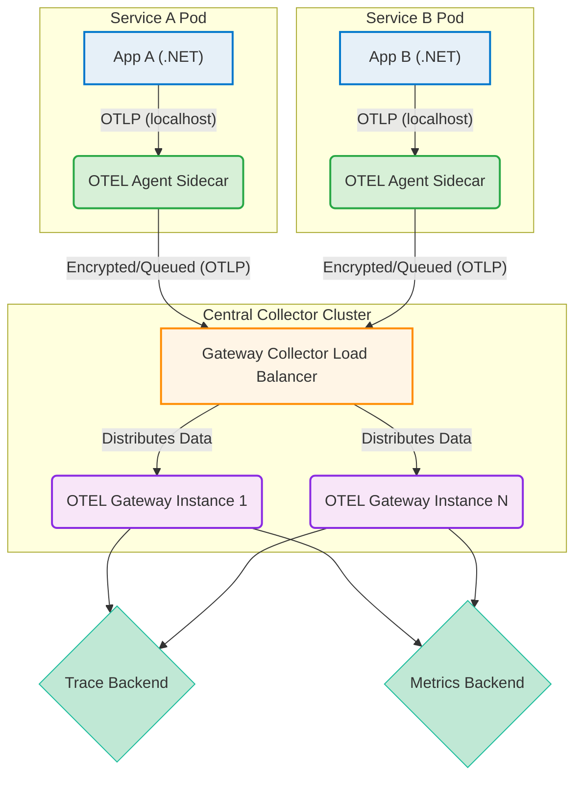

# SidecarTelemetry

# OpenTelemetry Collector Sidecar Pattern

This repository focuses on deploying the OpenTelemetry Collector using the **Sidecar Pattern**, a fundamental strategy for achieving highly reliable and low-latency observability pipelines in microservices architectures.

---

## 1. What is the OpenTelemetry Sidecar Pattern?

The Sidecar pattern is a deployment model where an **OpenTelemetry Collector** instance runs as a lightweight, companion container alongside the primary application container within the same deployment unit (e.g., a Kubernetes Pod or an ECS Task).

In this setup, the Collector operates in **Agent mode**.

| Component | Description |
| :--- | :--- |
| **Application Container** | Runs the business logic (e.g., a .NET service). It is instrumented and sends raw telemetry data to the Collector via a loopback address. |
| **Sidecar Collector** | Runs the OpenTelemetry Collector binary. It is configured to receive data from the adjacent application container via `localhost` using the OpenTelemetry Protocol (OTLP). |

This physical proximity means the application is not burdened with complex network export logic, retries, or batching—it simply streams raw data to a local endpoint, and the Collector handles the rest.

---

## 2. Advantages of the Sidecar Collector (Agent)

Running the Collector as a sidecar offers significant advantages right at the source of the telemetry:

### 🚀 Low Latency and High Reliability
* **Fast Communication:** Telemetry is sent over **`localhost`**, which is extremely fast and avoids network failure points and high network latency between the application and a remote collector.
* **Reduced Application Overhead:** The application is immediately freed from CPU-intensive tasks like data batching, compression, and exporting, allowing it to dedicate more resources to its core business logic.
* **Data Protection (Buffering):** Sidecar Collectors can use a **Persistent Queue** (disk buffering). If the upstream network or the centralized Gateway is temporarily unavailable, the Collector buffers the data locally on disk, preventing data loss.

### ⚙️ Simplified Operations
* **Decoupling:** Configuration changes for observability (e.g., updating an API key or adding a processor) can often be done by redeploying only the sidecar container, without modifying or restarting the primary application container.
* **Automatic Resource Enrichment:** The sidecar can easily inject highly accurate, instance-specific metadata (like container ID, pod name, and node information) into the telemetry data before it is exported.

---

## 3. The Combined Power: Sidecar + Gateway Architecture

For large-scale production environments, the Sidecar Collector (Agent) is best paired with a centralized **Gateway Collector** deployment. This creates a resilient, two-tiered architecture.

| Deployment Layer | Sidecar Collector (Agent Mode) | Gateway Collector (Central Mode) |
| :--- | :--- | :--- |
| **Location** | Co-located with the Application (in the same Pod/Task). | Centralized Cluster (separate Deployment/Service). |
| **Primary Role** | Local ingestion, batching, buffering, and resource enrichment. | Load balancing, global sampling, filtering, security, and export to backends. |
| **Owner** | Typically owned by the **Development Team** (per-service configuration). | Typically owned by the **Platform/SRE Team** (global governance). |

### Advantages of the Layered Architecture

1.  **Centralized Policy Enforcement:** The Gateway Collector acts as a single point for enforcing organization-wide observability policies, such as:
    * **Global Sampling:** Implementing tail-based sampling across all services to efficiently reduce data volume while ensuring complete traces are collected.
    * **Security:** Managing credentials and API keys for the final observability backend, isolating these sensitive secrets from individual microservice deployments.
2.  **Efficient Exporting:** The Gateway can efficiently manage connections, format data, and load balance traffic across multiple, diverse backends (e.g., traces to Jaeger, metrics to Prometheus, logs to Loki).
3.  **Horizontal Scalability:** The Gateway Collector can be scaled independently of the application to handle aggregated data volume spikes from all sidecars.

---

## 4. Architectural Diagram



# OpenTelemetry Collector Deployment Guide (Sidecar + Gateway)

This project demonstrates a robust, two-tiered observability architecture using the **OpenTelemetry Collector Sidecar Pattern** and a separate **Gateway Collector**. This setup mimics a production environment where the central gateway is deployed independently of the application services.

---

## 1. Project Structure

The repository is organized to clearly separate the central observability component from the microservice application component. It aims to simulate a real scenario where the Gateway collector is an independently deployed, standalone component, with it's own repository.

```
├── collector
│   ├── docker-compose.yaml
│   ├── otel-collector.yaml
├── web-api
│   ├── docker-compose.yaml
│   ├── otel-collector.yaml
│   └── ...
```

| File | Purpose |
| --- | --- |
| `collector/docker-compose.yaml` | Gateway collector container configuration. |
| `collector/otel-collector.yaml` | Gateway collector configuration. |
| `web-api/docker-compose.yaml` | Web API and Sidecar container configuration. |
| `web-api/otel-collector.yaml` | Sidecar collector configuration. |

---

## 2. OpenTelemetry Collector Configuration (`.yaml` Files)

The two collectors are configured differently to match their specific roles in the pipeline:

### A. The Gateway Collector (`collector/otel-collector.yaml`)

The Gateway Collector is the central point for **global policy, transformation, and final export**.

| Component | Purpose in Gateway Collector |
| --- | --- |
| **`receivers`** | **OTLP** is configured on port `4317` to accept aggregated, batched data **from all Sidecar Collectors**. |
| **`processors`** | Handles data normalization, adding global metadata, **filtering/sampling**, and batching for efficient export. |
| **`exporters`** | Configured to export data to the final observability backends. |

### B. The Sidecar Collector (`webapi/otel-collector.yaml`)

The Sidecar Collector is the **local agent** responsible for the lowest-latency path and basic preparation.

| Component | Purpose in Sidecar Collector |
| --- | --- | --- |
| **`receivers`** | **OTLP** is configured on port `4317` to accept raw, frequent data **from the local WebAPI container** (via `localhost`). |
| **`processors`** | Handles reliable transport by enabling a **persistent queue** and adding instance-specific metadata. |
| **`exporters`** | Configured to send all processed data **only to the Gateway Collector**, treating the Gateway as the "final" destination. |

---

## 3. How to Run the Containers

To run the complete architecture, follow these steps to deploy the Gateway first, and then the application service:

### Step 1: Deploy the Gateway Collector and Backend Services

Navigate to the root of the repository and start the Gateway Collector:

```bash
# Navigate to the repository root
cd /path/to/repo/

# Navigate to the collector repository
cd collector/

# Build and start the Gateway Collector
docker compose up -d
```

### Step 2: Deploy the WebAPI Service with the Sidecar

Navigate to the `webapi` folder and start the application and its co-located Sidecar Collector.

```bash
# Navigate to the webapi directory
cd webapi/

# Build and start the WebAPI and its Sidecar
docker compose up -d --build
```

### Step 3: Verify the Data Flow

1. Send an HTTP request to the WebAPI (e.g., GET localhost:8080/weatherforecast).
2. The WebAPI sends data to the Sidecar collector (at localhost:4317).
3. The Sidecar sends data to the Gateway collector (at host.docker.internal:4317).
4. The Gateway exports data to the container's logs.